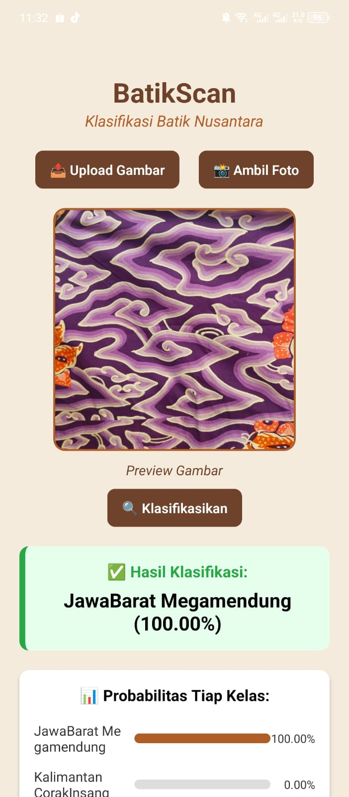

# 📱 BatikScan - Aplikasi Klasifikasi Batik Nusantara

  

**BatikScan** adalah aplikasi mobile berbasis **React Native (Expo)** yang memungkinkan pengguna mengunggah atau memotret gambar batik dan langsung mendapatkan hasil klasifikasi batik Nusantara menggunakan teknologi machine learning.

🎯 Cocok untuk pelajar, pengrajin batik, dan penikmat budaya Indonesia!

---

## 📦 Unduh APK

👉 [Klik di sini untuk mengunduh APK versi terbaru](./BatikScan.apk)

---

## 🚀 Fitur Utama

- 📤 **Upload Gambar** dari galeri
- 📸 **Ambil Foto Langsung** dari kamera
- 🧠 **Klasifikasi Otomatis** menggunakan model AI via API
- 📊 **Tampilkan Probabilitas** setiap kelas batik
- 🌐 Terhubung ke API FastAPI online
- 📱 Tampilan modern dan ramah pengguna

